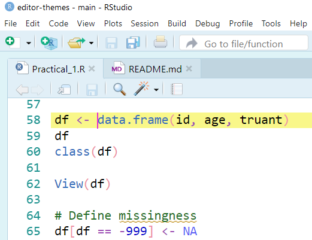
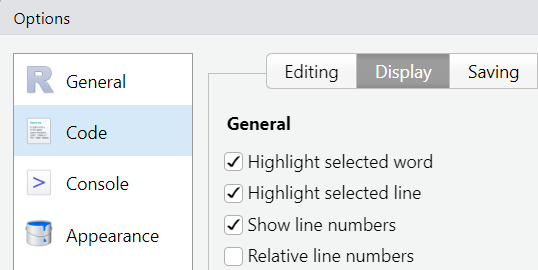

# editor-themes
Theme files for code editors including RStudio and Sublime Text.

# Overview of RStudio theme, Breeze
This light breeze theme highlights the current line and the cursor.

## Use RStudio theme, Breeze
Download the theme file here, [RStudio-Breeze-theme](RStudio/Breeze.rstheme)   and click on `Download raw file` icon to save it in your PC. Then, in RStudio, set this Breeze theme file.

To do so, go to:

> Tools > Global Options... > Appearance >  Editor theme:

Then click on `Add...` button (at the bottom) to select the downloaded theme file in your PC.

To ensure the current line is highlighted, 
tick the box for the `Highlight selected line` option under the menu:

> Tools > Global Options... > Code > Display

# References 
1. To learn how to customise a theme for RStudio, visit here:

https://www.r-bloggers.com/2018/04/make-rstudio-look-the-way-you-want-because-beauty-matters/

